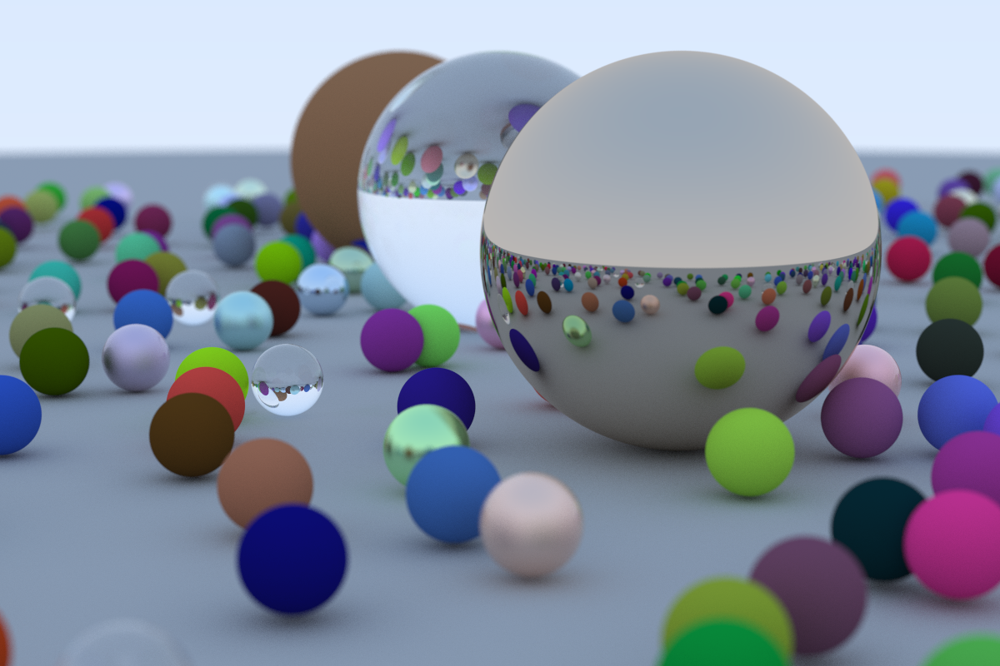

# Ray tracer
This is a ray tracer I built in C.
All the math libraries are handwritten.
Additionally, there are zero post-processing effects added, meaning every effect you see in the image below is 100% rendered i.e. depth of field, aperture size, anti-aliasing, etc.

It should also be noted this implementation uses barely any imports. I only import math for trigonometric functions and some definitions, stdio for printing, and stdlib for malloc.

## Examples

This render took about an hour on a Ryzen 5 1600.
The ray tracer is single-threaded and not GPU accelerated (yet).

### Tutorial

If you're interested in making this, you can check out the tutorial I used here: [_Ray Tracing in One Weekend_](https://raytracing.github.io/books/RayTracingInOneWeekend.html)

It should be noted however, the tutorial is in C++.